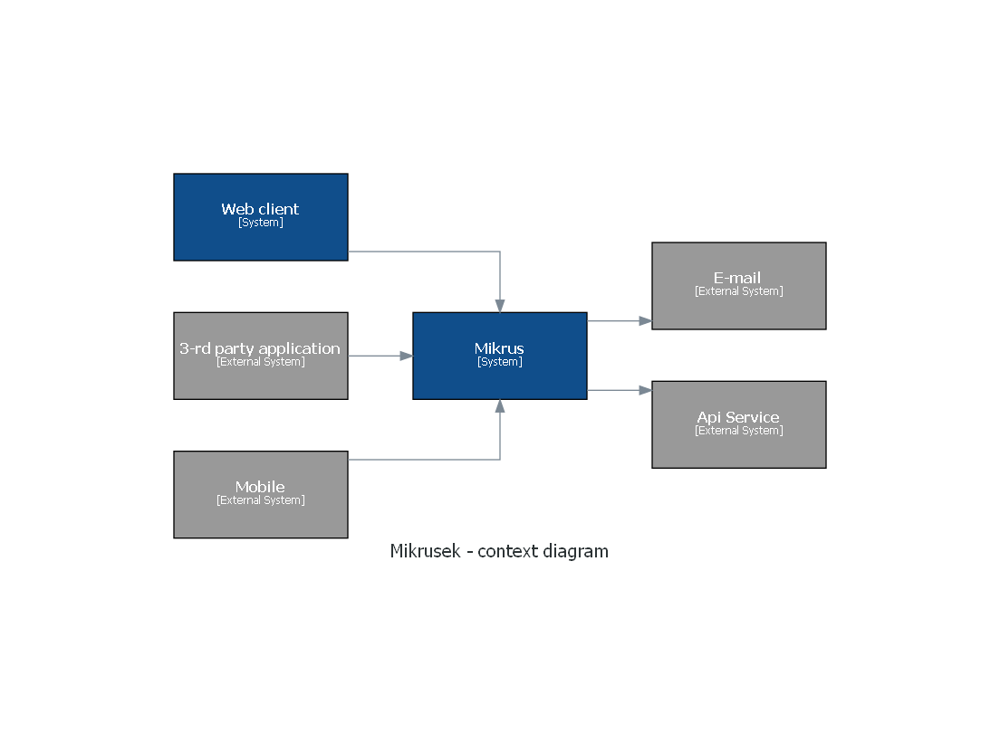

# Mikrusek

## Background

Mikrusek is not for any commercial usage.
You can assume that this was built only for educational purposes.
You can't create anything apart from the real world and therefore more about s perspective you will read in the 'Purpose' section.

## Tech-stack

### Languages 

- Python
- Java
- Kotlin

### Technologies

- Spring & Spring Boot
- Swagger
- Kafka
- Docker
- Protobuf

## Modules 

Micrusek consists of: 

- desing - Python module with design scripts
- TimeSeriesProcessing - Kotlin module accepting incoming time series data. Swagger is available here (http://localhost:8080/swagger-ui/index.html)
- InternalProtocol - library with generated protocol classes from proto schema.

## Purpose

Mikrus will be responsible for the storing time series data from multiple sources. Data from IOT, weather stations, meters and many sources will be able acceptable.   

## Architecture

### Context diagram



### Container


## Misc

### Docker

#### Docker compose

- docker/docker-compose.yaml - all inside 
- docker/docker-compose-no_processing.yaml - zookeeper + kafka + kafka manager

```
docker-compose up -d
docker-compose down 
docker-compose -f docker-compose-no_processing.yml up -d
```

#### Processing

```
docker build -t mikrusek-processing .
docker run -p 8081:8080 mikrusek-processing
http://localhost:8081/swagger-ui/index.html
```

#### Kafka

- zookeeper
- kafka

###  Kafka manager/Offse explorer 

Accessible using the following address

```
http://localhost:9000/
```
- add cluster typing zookeeper address

- preview topics/partitions/messages


